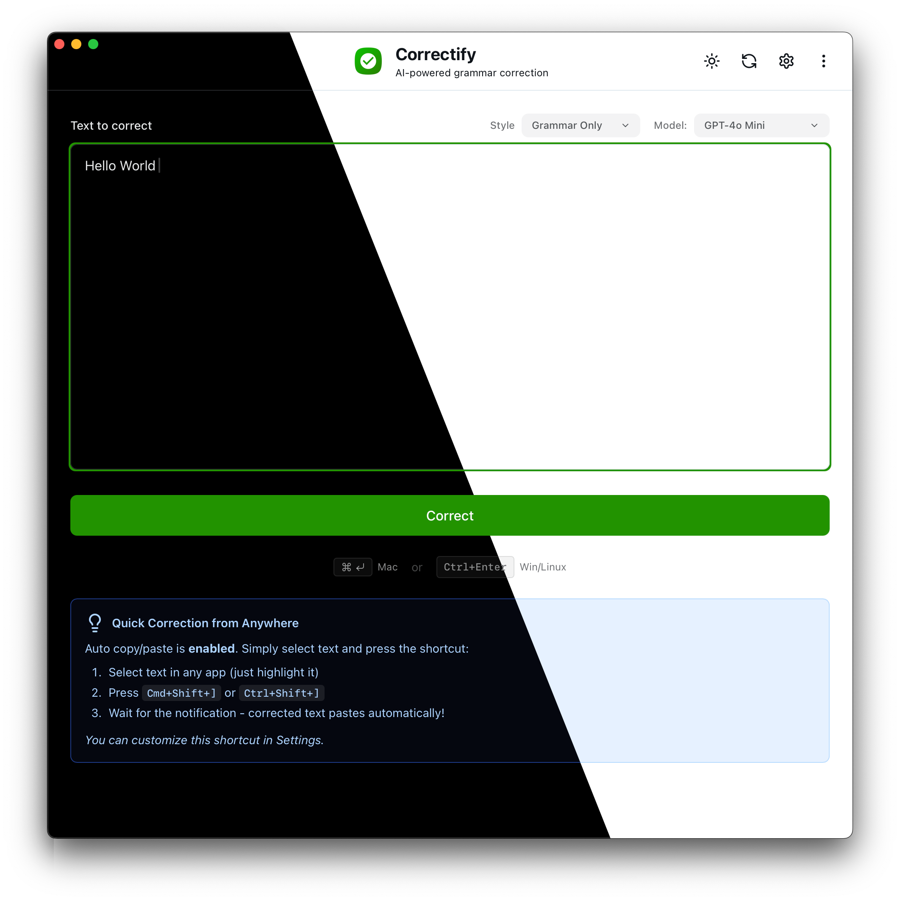

# Correctify

A simple, cross-platform grammar correction app powered by OpenAI. Bring your own API key, pay only for what you use, and keep your data private.



## Overview

Correctify corrects grammar, spelling, and punctuation while preserving your writing style and formatting. It's a minimal, distraction-free menubar app that works on macOS, Windows, and Linux.

**Key Features:**
- Menubar/tray app with global shortcuts
- Auto copy/paste functionality
- Writing style selector
- Privacy-first design
- Cross-platform support

For detailed user documentation, visit the [landing page](https://tarikkavaz.github.io/Correctify/).

## Development Setup

### Prerequisites

- **Node.js** (v18 or later)
- **pnpm** package manager
- **Rust** (latest stable version)
- **Tauri CLI** (installed via `cargo install tauri-cli`)

### Installation

1. Clone the repository:
```bash
git clone https://github.com/tarikkavaz/Correctify.git
cd Correctify
```

2. Install dependencies:
```bash
pnpm install
```

### Development

Start the development server:

```bash
# Web development server
pnpm dev

# Tauri development (recommended)
pnpm tauri:dev
```

The Tauri development command will:
- Start the Next.js development server
- Launch the Tauri app with hot reload
- Enable debugging and development tools

### Building

Build the application for production:

```bash
# Web build only
pnpm build

# Tauri build (cross-platform)
pnpm tauri:build
```

The Tauri build will create platform-specific installers in `src-tauri/target/release/bundle/`.

### Project Structure

```
Correctify/
├── app/                    # Next.js app directory
│   ├── api/               # API routes
│   ├── globals.css        # Global styles
│   └── layout.tsx         # Root layout
├── components/            # React components
├── lib/                   # Utilities and types
├── public/               # Static assets
├── src-tauri/           # Tauri backend (Rust)
│   ├── src/             # Rust source code
│   ├── Cargo.toml       # Rust dependencies
│   └── tauri.conf.json  # Tauri configuration
├── docs/                # Documentation
└── scripts/             # Build scripts
```

## macOS Code Signing & Notarization

To distribute signed and notarized macOS apps, you'll need Apple Developer credentials.

### Setup

1. Copy the environment template:
```bash
cp .env.example .env
```

2. Fill in your Apple Developer credentials in `.env`:
```env
APPLE_ID=your-apple-id@example.com
APPLE_PASSWORD=xxxx-xxxx-xxxx-xxxx
APPLE_TEAM_ID=XXXXXXXXXX
```

**Getting your credentials:**
- **Apple ID**: Your Apple Developer account email
- **Apple Password**: Generate an app-specific password at [appleid.apple.com/account/manage](https://appleid.apple.com/account/manage)
- **Team ID**: Find in your Apple Developer account settings

### Building Signed Apps

Use the provided script for automated signing and notarization:

```bash
chmod +x scripts/build-signed.sh
./scripts/build-signed.sh
```

This script will:
1. Build the Tauri app
2. Code sign the application
3. Create a DMG installer
4. Notarize with Apple
5. Staple the notarization ticket

### Manual Process

For manual signing, refer to:
- [Apple's official notarization guide](https://developer.apple.com/documentation/security/notarizing_macos_software_before_distribution)
- [Tauri's code signing documentation](https://tauri.app/distribute/sign/macos/)

## Contributing

1. Fork the repository
2. Create a feature branch: `git checkout -b feature-name`
3. Make your changes
4. Test thoroughly
5. Submit a pull request

## License

MIT License

## Support

- **User Documentation**: [docs/index.html](docs/index.html)
- **Issues**: [GitHub Issues](https://github.com/tarikkavaz/Correctify/issues)
- **Releases**: [GitHub Releases](https://github.com/tarikkavaz/Correctify/releases)