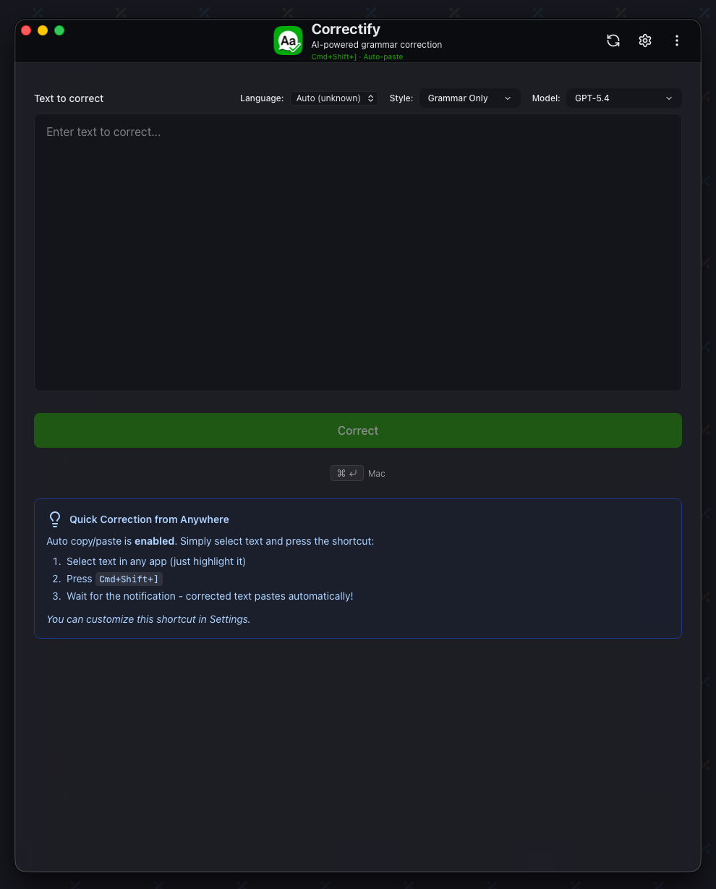

# Correctify

A cross-platform, desktop-first grammar correction app powered by multiple AI providers.
Bring your own API key, choose a tested low-cost model, and keep credentials in your operating system's credential vault.



## Overview

Correctify corrects grammar, spelling, and punctuation while preserving your writing style and formatting.
It's a minimal, distraction-free menubar app that works on macOS, Windows, and Linux.

**Key Features**
- **Native API Key Storage** - macOS Keychain, Windows Credential Manager, or Linux Secret Service
- **Multiple LLM Providers** - OpenAI, Anthropic, Mistral, and OpenRouter
- **Free Fallback Available** - OpenRouter's adaptive free router (availability and selected model may vary)
- **Usage Tracking** - Monitor token usage, costs, and performance locally
- **Intentional Fallback** - One-click retry with the OpenRouter free router after transient failures
- **Global Shortcuts** - Correct text from anywhere with customizable shortcuts
- **Auto Copy/Paste** - Seamless text correction in any app
- **5 Writing Styles** - Grammar, Formal, Informal, Collaborative, Concise
- **Custom Update Notifications** - Beautiful in-app update modal with release notes
- **Full Localization** - Complete translation support (English, German, French, Turkish)
- **Modern UI** - Clean interface
- **Desktop-only credentials** - Browser builds never accept or persist API keys
- **Cross-Platform** - macOS, Windows, and Linux support


## Supported Models

### Paid Models (API Key Required)
- **OpenAI**: GPT-5.4 Nano (default), GPT-5.4 Mini
- **Anthropic**: Claude Haiku 4.5
- **Mistral**: Ministral 3B

### Free Models (OpenRouter API Key Required)
- **OpenRouter Free**: `openrouter/free`, which selects an available free model for each request

> [!NOTE]
> OpenRouter free models require a free account and API key (no credit card needed).

## API Key Configuration & Security

- **OS Credential Vault** - Keys are stored in the platform credential service, never as app files
- **Automatic Migration** - Imports legacy localStorage/base64-file keys and deletes each legacy copy after a successful import
- **Per-Provider Keys** - Configure keys for each provider independently
- **Desktop Only** - API keys never persist in localStorage or browser builds

All API requests are made directly from your device to the selected LLM provider. No intermediary server or data collection is used.

## Signed Updates

Release builds require the `TAURI_UPDATER_PRIVATE_KEY` and `TAURI_UPDATER_PUBKEY` GitHub secrets. The workflow fails if either secret or any platform signature is missing. Generate the keypair once with the Tauri signer, store the private key only in GitHub Secrets, and use the public key secret to embed verification material in release builds.


## Development Setup

### Prerequisites

- **Node.js** (v18 or later)
- **pnpm** package manager
- **Rust** (latest stable version)
- **Tauri CLI** (installed via `cargo install tauri-cli`)

### Installation

1. Clone the repository:
```bash
git clone https://github.com/tarikkavaz/Correctify.git
cd Correctify
```

2. Install dependencies:
```bash
pnpm install
```

### Development

Start the development server:

```bash
# Web development server
pnpm dev

# Tauri development (recommended)
pnpm tauri:dev
```

The Tauri development command will:
- Start the Next.js development server
- Launch the Tauri app with hot reload
- Enable debugging and development tools

### Building

Build the application for production:

```bash
# Web build only
pnpm build

# Tauri build (cross-platform)
pnpm tauri:build
```

The Tauri build will create platform-specific installers in `src-tauri/target/release/bundle/`.

### Project Structure

```
Correctify/
├── app/                 # Next.js app directory
│   ├── api/             # API routes
│   ├── globals.css      # Global styles
│   └── layout.tsx       # Root layout
├── components/          # React components
├── lib/                 # Utilities and types
├── public/              # Static assets
├── src-tauri/           # Tauri backend (Rust)
│   ├── src/             # Rust source code
│   ├── Cargo.toml       # Rust dependencies
│   └── tauri.conf.json  # Tauri configuration
├── docs/                # Documentation
└── scripts/             # Build scripts
```

## macOS Code Signing & Notarization

To distribute signed and notarized macOS apps, you'll need Apple Developer credentials.

### Setup

1. Copy the environment template:
```bash
cp .env.example .env
```

2. Fill in your Apple Developer credentials in `.env`:
```env
APPLE_ID=your-apple-id@example.com
APPLE_PASSWORD=xxxx-xxxx-xxxx-xxxx
APPLE_TEAM_ID=XXXXXXXXXX
```

**Getting your credentials:**
- **Apple ID**: Your Apple Developer account email
- **Apple Password**: Generate an app-specific password at [appleid.apple.com/account/manage](https://appleid.apple.com/account/manage)
- **Team ID**: Find in your Apple Developer account settings

### Building Signed Apps

Use the provided script for automated signing and notarization:

```bash
chmod +x scripts/build-signed.sh
./scripts/build-signed.sh
```
or use the `pnpm tauri:build:signed`.

This script will:
1. Build the Tauri app
2. Code sign the application
3. Create a DMG installer
4. Notarize with Apple
5. Staple the notarization ticket

### Manual Process

For manual signing, refer to:
- [Apple's official notarization guide](https://developer.apple.com/documentation/security/notarizing_macos_software_before_distribution)
- [Tauri's code signing documentation](https://tauri.app/distribute/sign/macos/)

## Contributing

1. Fork the repository
2. Create a feature branch: `git checkout -b feature-name`
3. Make your changes
4. Test thoroughly
5. Submit a pull request

## License

MIT License

## Support

- **Issues**: [GitHub Issues](https://github.com/tarikkavaz/Correctify/issues)
- **Releases**: [GitHub Releases](https://github.com/tarikkavaz/Correctify/releases)
